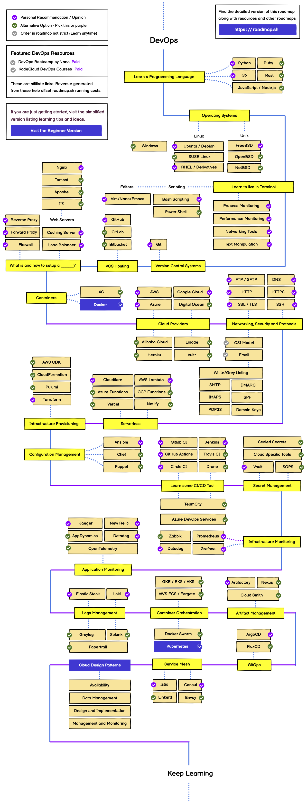
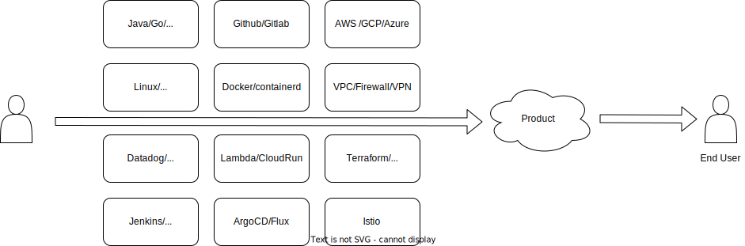
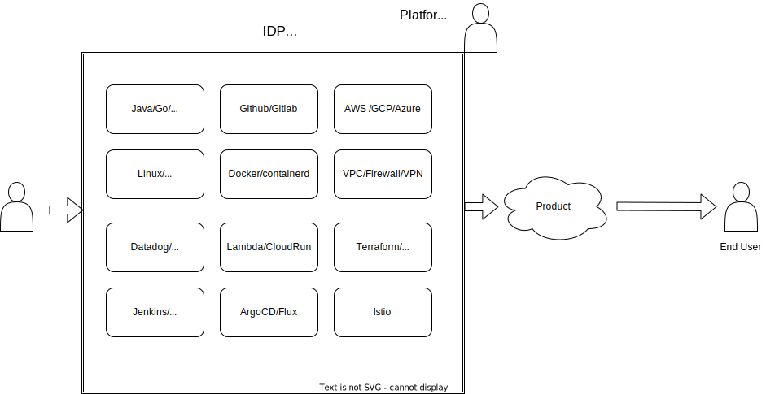

<!--
_class: lead
-->
# DevOpsのこれからと Platform Engineering

2023/09/29

---

# DevOpsとは

- 「顧客に価値を素早く届けるため、開発・運用が協力する、文化的な姿勢・取り組み」のこと [^1]
- デプロイまでの流れを高速化し、開発・運用のサイロを取り除く文化が重要
- (企業によってポジショントークがあり、定義が異なるためややこしい)

[^1]: https://www.members-devopslead.com/service

---

# DevOpsの実践度

-  IDC Japanの調査によると、DevOpsの実践率は年々伸びている。 [^2]
- 2022年の調査では **59.3%** の実践率
- しかし、結論として「**ビジネス上の効果が得られている企業は増えていない**」とある。

[^2]: https://www.idc.com/getdoc.jsp?containerId=prJPJ49999523

---

<!--
_class: lead
-->
# DevOpsの**実践**は難しい

---

# 例:DevOps に求められる技術

学習ロードマップとして

`Programming Language, OS, VCS, Containers, Cloud Providers, Network, Serverless, IaC, CI/CD Tool, GitOps, ServiceMesh etc...`

などが挙げられている。[^3]

[^3]: https://roadmap.sh/devops

---

# つまり、DevOpsを落とし込むと、、、

エンドユーザーに届けるまでに多くの技術が関わる

---
<!--
_class: lead
-->
# 開発者「こんなに意識しきれない・・・」

---
# よくある導入

## DevOps Team Silo [^4]
- 「DevOpsチームを新しく作ったから、DevからOpsに渡るまでのセットアップはよろしく！」
- マイクロサービスごとにセットアップを任せられる。

[^4]: https://owasp.org/www-pdf-archive/Zero-to-DevSecOps-OWASP-Meetup-02-19-19_-_part_1.pdf

---
<!--
_class: lead
-->
# DevOpsチーム「管理しきれない・・・」

---

<!--
_class: lead
-->
# デプロイ・運用までを 抽象化できるPlatformが必要

---

<!--
_class: lead
-->
# **Platform Enginieering**の需要

---

## Platform Enginieeringとは

- Garthnerの「先進テクノロジのハイプ・サイクル：2022年」で登場 [^5]
- 開発者体験と生産性を向上させるためにセルフサービスで利用できるツールチェーンとワークフローを設計・構築する分野 [^6]

[^5]: https://www.gartner.co.jp/ja/newsroom/press-releases/pr-20220816
[^6]: https://speakerdeck.com/jacopen/platform-engineeringhenozhao-dai?slide=8

---

# どう変わるのか
開発者は抽象化されたセルフサービス基盤(IDP)でデプロイする [^7]

[^7]: https://speakerdeck.com/jacopen/platform-engineeringhenozhao-dai?slide=18

---

<!--
_class: lead
-->
# 開発者が多様なツールを意識せずとも開発に集中できるように

---

<!--
_class: lead
-->
# DevOpsや共通基盤を 言い換えただけでは？ 🧐

---
# Platform Enginieeringは何が違うのか

- 顧客 = 開発者 として、『価値』を届けることを重視する。
  - 価値: 開発者の認知負荷を軽減する
- **Platformを製品として**捉える。 => 『Platform as a Product』
- ゴールデンパスを用意する [^8]

事例
- [開発者向けの基盤をつくる - メルカリ](https://speakerdeck.com/tcnksm/kai-fa-zhe-xiang-kefalseji-pan-wotukuru)
- [ヤフーで KaaS ベースの PaaS ができるまで](https://www.docswell.com/s/ydnjp/ZDED1L-2023-03-06-151122#p1)

[^8]: https://cloud.google.com/blog/ja/products/application-development/golden-paths-for-engineering-execution-consistency

---
<!--
_class: lead
-->
# 開発者を補助するための内部Platformを一つの製品としてデザインする  => 製品開発と同じアプローチを取る

---
<!--
_class: lead
-->

#  忘れてはならない **DevOpsは文化**

---

 [^9]

[^9]: https://x.com/jacopen/status/1706218493262323940?s=20

---

# サイロと文化を改善する

- まず**己の組織を知る**
  - 組織文化のモデル化と測定 例: [Westrum の組織類型](https://cloud.google.com/architecture/devops/devops-culture-westrum-organizational-culture?hl=ja)
- 開発と運用の**責任の共有**
- アプローチ例
  - チーム間で同じ立場にある人同士で信頼関係を築く
  - 現場担当者に部署間の移動を促す
  - チームの協働を容易にする作業を推進し、成功すれば褒賞を出す
  - 情報共有のための場作り

---

<!--
_class: lead
-->

# 文化改善も変わらず重要

---

<!--
_class: lead
-->

#  **Platform**で組織の連携を加速させる
具体例はまだ思い浮かびません 😢

---

# 「やりたいことなんてない。これから見つけられるかどうかもわからない。でもみんながやりたいことがあるならそれを援護することはできる」

*SHIROBAKO ©「SHIROBAKO」製作委員*

---

<!--
_class: lead
-->

# DevOposは愛❤️

---

# まとめ

- DevOpsの実践はツール群の複雑な組み合わせにより実現され、認知コストが高い
- そこでPlatform Engineeringによる製品開発のアプローチで、開発者の認知コストを下げた開発フローを構築
- しかし、Platformのみでは組織は改善されず、文化改善のアプローチも重要
- 文化改善に繋がるPlatformをデザインすることが鍵になる(と思われる)

---

**※ 蛇足**
このスライドは **Marp** というMarkdownをスライドに変換出来るツールで作っています。[^1]
スライドをMarkdownで管理してみたいそこのあなた！
是非お試しを！

[^1]: https://marp.app/

参考: [Marp入門〜応用｜markdownでプレゼン資料を楽に素早く作って発表しよう](https://zenn.dev/cota_hu/books/marp-beginner-advanced)