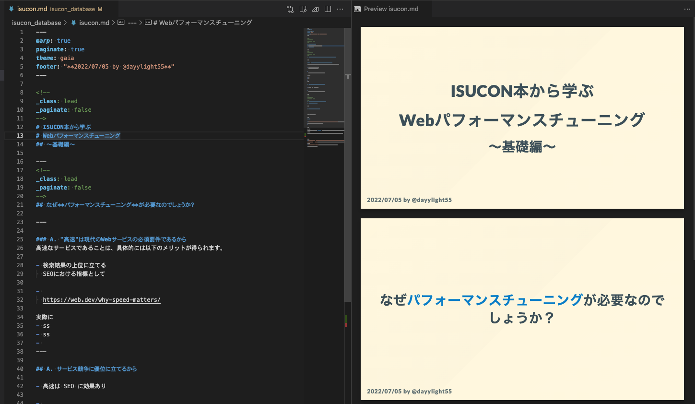

<!--
_class: lead
_paginate: false
-->
# ISUCON本から学ぶ
# Webパフォーマンスチューニング
## 〜基礎編〜

---
<!--
_class: lead
_paginate: false
-->
## Q. なぜ**パフォーマンスチューニング**が必要
## なのでしょうか？

---

### A. "高速であること"は現代のWebサービスの必須要件であるから
高速なサービスであることは、具体的には以下のメリットが得られます。

- 検索結果の上位に立てる
  SEOにおける指標として

- 
  https://web.dev/why-speed-matters/

---

http://abehiroshi.la.coocan.jp/

---

https://www.webpagetest.org/result/220706_AiDc25_6PJ/

---

## A. サービス競争に優位に立てるから

- 高速は SEO に効果あり

- 
  https://web.dev/why-speed-matters/

---
<!--
_class: lead
_paginate: false
-->
## 速くしろとか簡単に言ってくれるけど
## どうすりゃいいのさ

---

# **分析と改善**を繰り返す

例) RDBMSの場合

---
# 参考

- [Webパフォーマンスチューニングに関する情報源まとめ（随時更新）](https://zenn.dev/sugamaan/articles/4e57703fe661bb)
- 

---
※ 蛇足
因みにこのスライドは **Marp** というMarkdownをスライドに起こせるツールを使用して作りました。
VSCode拡張を使うと手軽にMarkdownでのスライド作成が出来るのでオススメです。

参考
- [「Marp」【レビュー】 - 窓の杜](https://forest.watch.impress.co.jp/docs/review/1422278.html)
- [Marp(Marpit) - Qiita](https://qiita.com/takeshisakuma/items/5a61e6eac123d28602fb)
